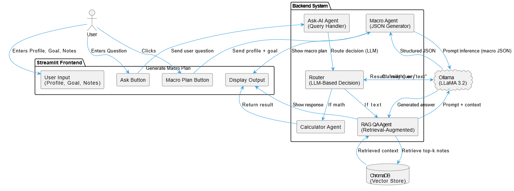

# 🌐 LocalSmart: AI Assistant using RAG, LangChain, and Local LLM

This project is a fully local, privacy-friendly AI assistant that combines **LangChain**, **Retrieval-Augmented Generation (RAG)**, and **LLaMA 3.2** via **Ollama** to simulate a multi-agent intelligent system.

It runs **completely offline**, supports structured JSON generation, vector-based personalized responses, and intelligent agent routing.

---

## 🎓 Features

- ✨ **Multi-Agent AI Architecture** using LangChain
- 📃 **RAG pipeline** with Chroma vector database and local embeddings
- 🤖 **LLM Inference** fully local via [Ollama](https://ollama.com)
- 🔢 **LLM Router** routes queries to the correct agent
- 🔄 **Calculator Agent** for math questions
- 👨‍🌾 **Macro Planner Agent** outputs structured daily nutritional macros in JSON format
- 💡 **Streamlit UI** for easy user interaction
- ❌ No OpenAI or external APIs used

---

## 🚀 Getting Started

### 1. Clone the Repository

```bash
git clone https://github.com/<your-username>/localsmart-ai-assistant.git
cd localsmart-ai-assistant
```

### 2. Setup Virtual Environment

```bash
python -m venv venv
source venv/bin/activate  # Windows: venv\Scripts\activate
```

### 3. Install Dependencies

```bash
pip install -r requirements.txt
```

### 4. Pull LLaMA 3.2 model with Ollama

```bash
ollama pull llama3.2
```

### 5. Run the App

```bash
streamlit run main_ui.py
```

---

## 👩‍💼 Use Case Flow

1. Enter your **profile and fitness goal** (e.g. 70kg, gain muscle)
2. Click **"Generate Macro Plan"** → AI returns JSON with calories, protein, carbs, fats
3. Add **personal notes** (e.g. "I have knee pain")
4. Ask a **fitness question** → AI retrieves your notes and returns a customized answer
5. Ask a **math question** → Router forwards to calculator agent

---

## 🔄 Architecture




- **Frontend**: Streamlit app with inputs, outputs, buttons
- **Agents**:
  - Macro Agent (LLM + JSON parser)
  - Router Agent (LLM classification)
  - Calculator Agent (safe math eval)
  - RAG QA Agent (Vector retrieval + LLM)
- **Embeddings**: `mxbai-embed-large` via Ollama
- **Vector DB**: Chroma (local, persistent)
- **LLM**: `llama3.2` (via Ollama)

---

## 📘 File Structure

```bash
localsmart-ai-assistant/
├── main_ui.py              # Streamlit interface
├── agents.py               # Core agent logic (macro, calculator, RAG, router)
├── prompts.py              # Prompt templates for LangChain
├── vector_store.py         # Chroma vector DB setup and storage
├── macro_flow_ai.py        # CLI test for macro agent
├── ask_flow_ai.py          # CLI test for QA agent
├── architecture.png        # Architecture diagram (for README)
├── requirements.txt        # Dependencies
└── README.md
```

---

## 🌟 Credits

Built by **Druva S Kumar** as part of a LangChain + RAG internship assessment.

---

## 📤 Deployment (optional)

- Can be containerized with Docker
- Deployable to Hugging Face Spaces or Render
- Can run fully offline with zero API dependency

---

## 🌐 License

MIT License. Use freely and ethically.

